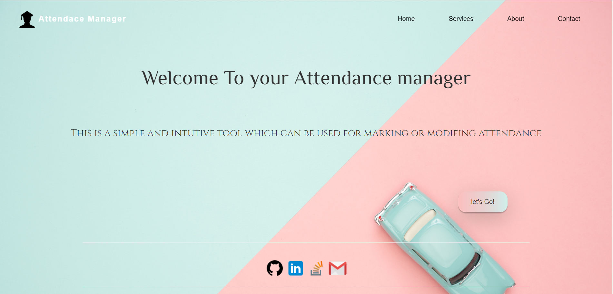
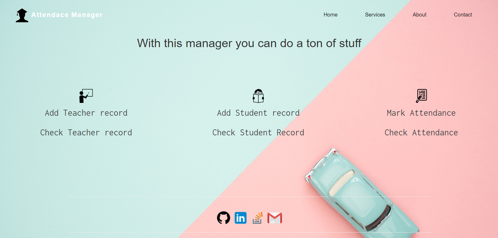

# Attendance Manager

this program can help you to mange your class attendance easily


## main menu
hey , Welcome to your attendance manager. 
 


 ##setup
 
 You just need to setup python 3.7 and mysql db and django


 
 and fill connection details in db.py and settings.py in front_main
 
 ```
db = mysql.connect(
    host = 'XXXX',
    user = 'XXXX',
    port = 'XXXX',
    password = 'XXXX',

)
```
add absolute path of this repo in to environment variable path

Everything else will be taken care of by this program itself


# run-

start django server from front_main file

# note-

all check records are working 

add records are under construction ;)

